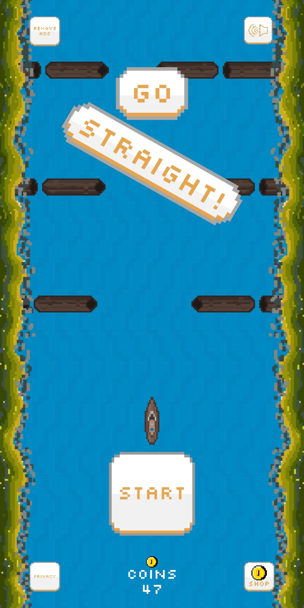
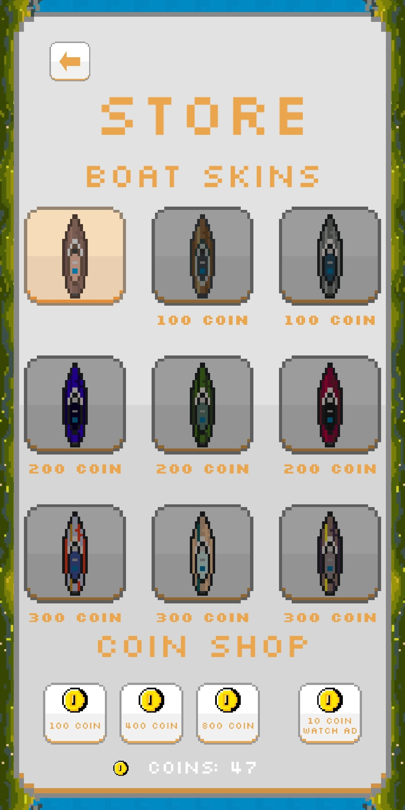
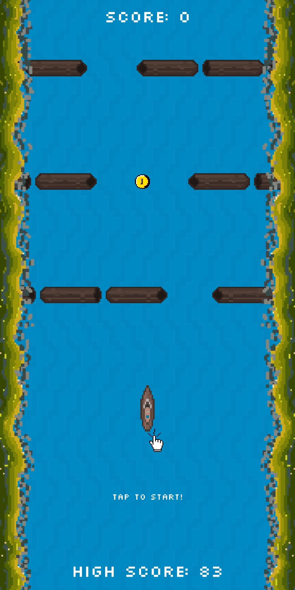
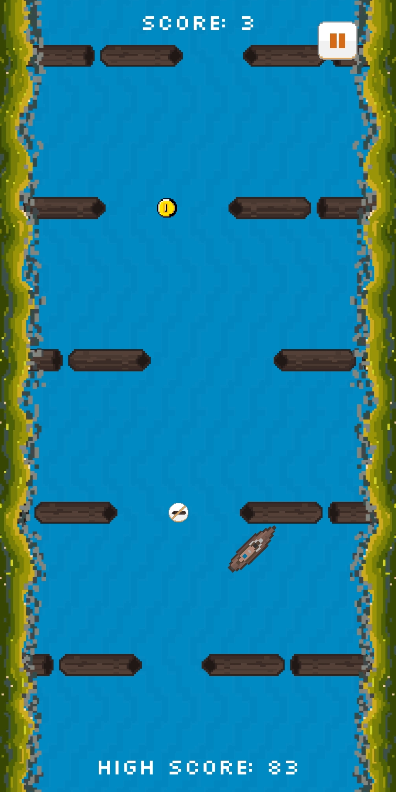
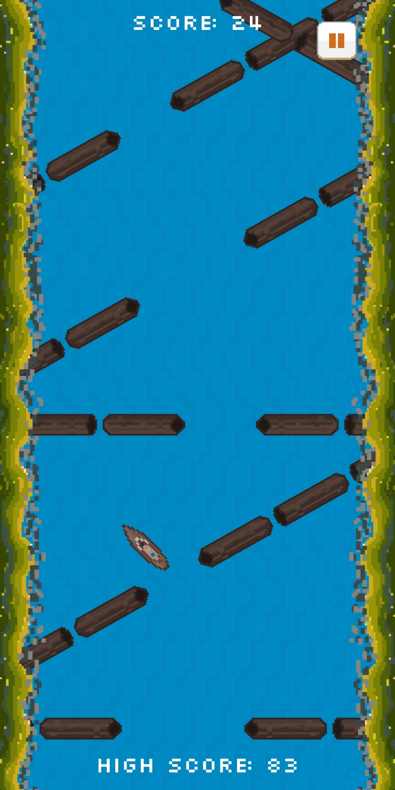
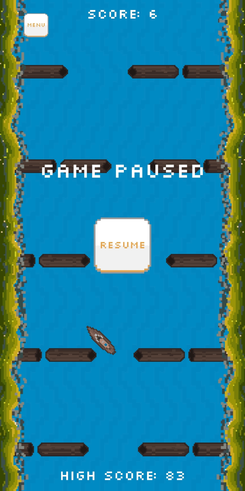
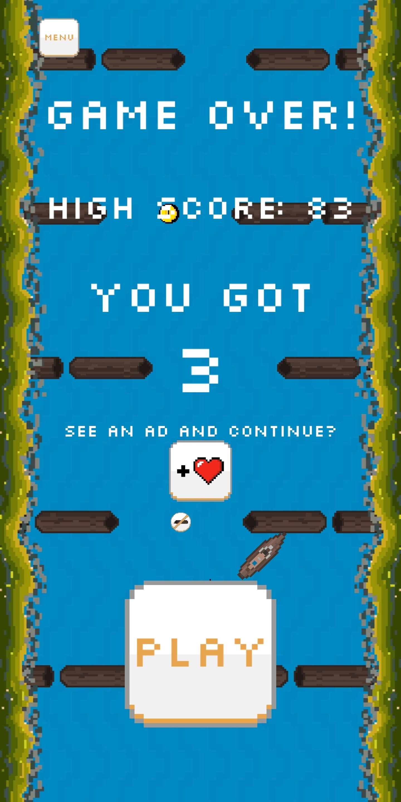

# Go-Straight

Go Straight, a 2D Hyper Casual Game

Try to move through the wood logs in the river by navigating your boat. However there is a catch, you can only move diagonally!

# Notes
- Go Straight is a game made using the Unity Game Engine.
- All assets are drawn by me using piskel app.
- This is my first experiment with making a proper game for publishing to the store.

Play Store Link:
https://play.google.com/store/apps/details?id=com.AyGames.GoStraight

Video of the game:
https://www.youtube.com/watch?v=eGSqb3kJdv4

Gallery:

